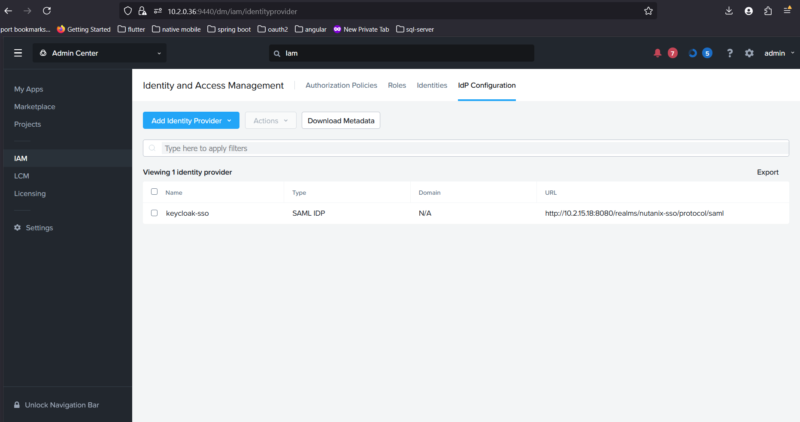
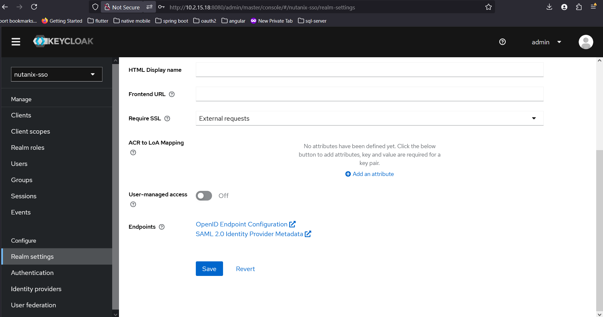
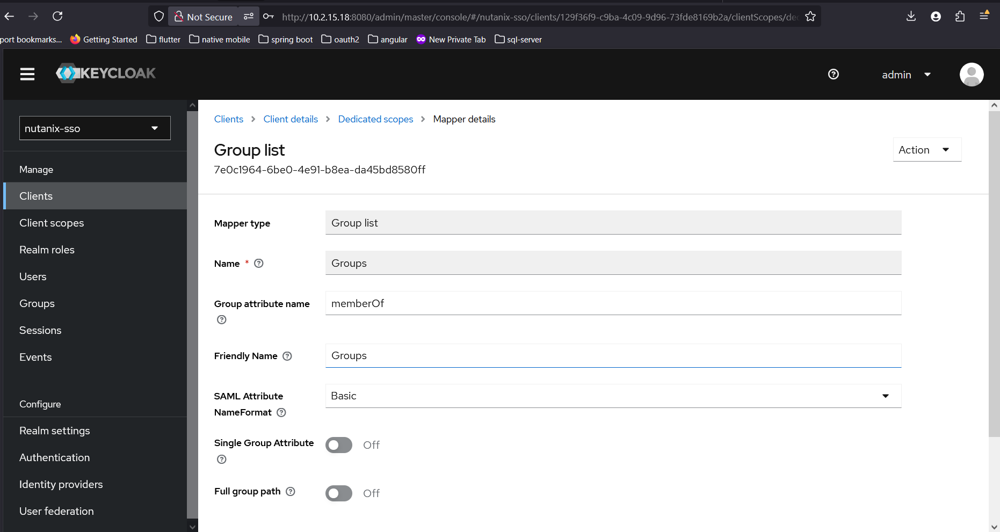
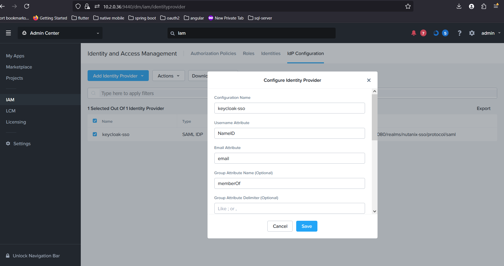
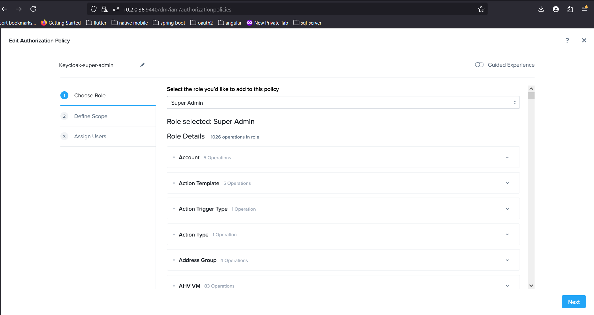
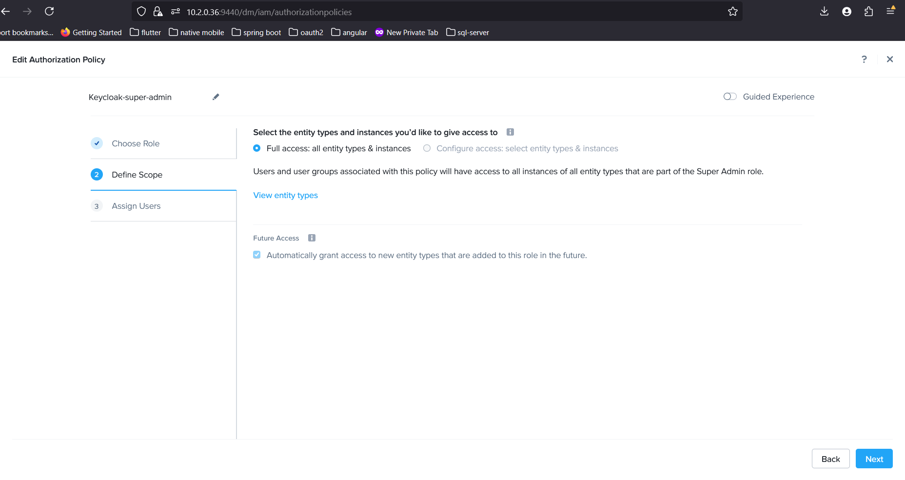

# Keycloak Integration with Nutanix Prism Central

## 1. Overview
This document describes how to integrate **Keycloak** as the **Identity Provider (IdP)** with **Nutanix Prism Central (PC)** as the **Service Provider (SP)** using **SAML 2.0**.  
It also covers how to use **Keycloak Groups** to manage **Prism Central Authorization Policies**.

---

## 2. Prerequisites
Before starting, ensure you have:

- Administrator access to **Nutanix Prism Central (PC)**
- Administrator access to **Keycloak**
- A **DNS-resolvable URL** or reachable IP for Keycloak
- **TLS/SSL certificates** configured on Keycloak *(recommended for production)*
- A test user in Keycloak
- A browser extension like **SAML-Tracer** for debugging SAML requests/responses

---

## 3. Download Metadata Files
Before configuration, download the metadata from both Prism Central and Keycloak.

### 3.1 From Nutanix Prism Central
- Go to the **SSO Configuration** page in Prism Central
- Download the **Prism Central (SP) Metadata XML**

---

### 3.2 From Keycloak
- Log in to the **Keycloak Admin Console**
- Go to the SAML client you’ll use for Prism Central
- Download the **Keycloak (IdP) Metadata XML**

---

## 4. Configure Keycloak

### 4.1 Create a Realm *(if needed)*
1. Log in to the **Keycloak Admin Console**
2. Click **Add Realm**
3. Provide a name, for example: `nutanix-sso`

---

### 4.2 Import Prism Central Metadata
1. Go to **Clients → Create Client**
2. Click **Import**
3. Upload the `metadata.xml` downloaded from **Prism Central**
4. Save the client configuration

---

## 4.3 Configure Logout Service URL
1. Open the newly created **Client**.
2. Go to the **Advanced** tab.
3. In **Logout Service Redirect Binding URL**, enter:
https://10.2.0.36:9440/api/iam/authn/callback

4. Save the configuration.

---

## 4.4 Configure SAML Capabilities
1. Go to **Clients → [your SAML client] → Settings → SAML Capabilities**.
2. Configure the following:
- **Name ID Format:** `email` (or `username` if Prism Central is set to use `username`)
- **Force Name ID Format:** `On`
- **Force POST Binding:** `On`
- **Force Artifact Binding:** `Off`
- **Include AuthnStatement:** `On`
- **Include OneTimeUse Condition:** `Off`
- **Optimize REDIRECT Signing Key Lookup:** `Off`
- **Front channel logout:** `Off`
3. Click **Save**.

---

### 4.5 Create Groups
Create groups to differentiate user permissions:
- `pc-admin-keycloak`
- `pc-operator-keycloak`

These groups will later be mapped to Prism Central Authorization Policies.

---

### 4.6 Create Users and Assign Groups
1. Go to **Users → Add User** and create the test or production users.
2. Under the user’s **Groups** tab, add them to the appropriate group(s):
   - `pc-admin-keycloak`
   - `pc-operator-keycloak`

---

### 4.7 Add Group Mapper
To pass group membership to Prism Central via SAML:

1. Go to **Clients → [your SAML client]**
2. Open the **Client Scopes** tab
3. Click on the assigned client scope, for example:
   - `https://10.2.0.36:9440/api/iam/authn-dedicated`
4. Go to **Mappers → Create Mapper**
5. Choose **Mapper Type: Group List**
6. Configure the mapper:
   - **Name:** `Groups`
   - **Group Attribute Name:** `member`
   - **SAML Attribute NameFormat:** `Basic`
   - Enable **Single Group Attribute**
   - Enable **Full Group Path**
7. Save the mapper

---

## 5. Configure Nutanix

### 5.1 Add Identity Provider
1. Log in to **Prism Central** as an administrator.
2. Go to **IAM Configuration**.
3. Click **Add Identity Provider**.
4. Import the **Keycloak IdP Metadata** file you downloaded earlier.

---

### 5.2 Create Authorization Policy
1. Go to **Authorization Policies** in Prism Central.
2. Click **Create Authorization Policy**.
3. Configure the policy:

   - **Choose Role:**  
     Select a built-in Prism Central role (e.g., **Prism Admin**, **Prism Operator**) or a custom role.

     

   - **Define Scope:**  
     Specify the resources or clusters this policy applies to (e.g., all clusters or specific ones).

     

   - **Assign Users or Groups:**  
     Assign the Keycloak **groups** (e.g., `pc-admin-keycloak`, `pc-operator-keycloak`) that were mapped via SAML.

     

4. Save the policy.

---